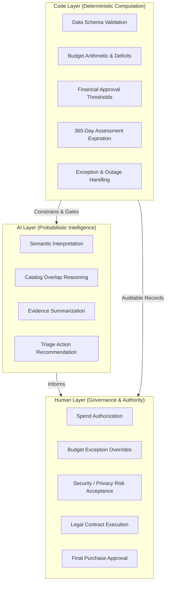

# 08. Architecture Principles: AI Procurement Request Copilot

**Document Version:** 1.0.0  
**Status:** Baseline Specification (Phase 1 Source of Truth)  
**Author:** Forward Deployed Engineering (FDE)

---

## 1. Core Architectural Triad: Division of Responsibility

A fundamental premise of Forward Deployed Engineering in high-stakes enterprise systems is establishing clean, non-negotiable boundaries between probabilistic intelligence, deterministic computation, and human governance.

### 1.1 The AI Boundary (Interpretation & Recommendation)
* **What AI Does:**
  * Interprets ambiguous, qualitative natural language justifications submitted by requesters.
  * Evaluates functional similarity between requested tools and existing catalog software (semantic matching).
  * Synthesizes complex multi-source findings into concise, readable evidence summaries.
  * Formulates structured, context-aware next-step triage recommendations for the human specialist.
* **What AI Never Does:**
  * Calculates financial thresholds or budget arithmetic.
  * Decides whether spend is authorized.
  * Alters system state or executes transactions.

### 1.2 The Code Boundary (Deterministic Verification & Hard Gates)
* **What Code Does:**
  * Enforces data schema parsing and checks for missing mandatory fields (`missing_information`).
  * Executes exact budget math: $\text{available\_usd} = \text{annual\_software\_budget} - \text{committed\_usd}$.
  * Applies financial tier approval gates ($1,000, $10,000, $25,000 brackets).
  * Computes date staleness against the reference date `2026-09-30` (365-day rule).
  * Gracefully traps API network timeouts and HTTP 503 errors.
  * Appends mandatory governance approvers (Security, Privacy, Legal, Finance, CFO) deterministically based on trigger criteria.

### 1.3 The Human Boundary (Authority & Final Signoff)
* **What Humans Do:**
  * Possess the sole, non-delegable authority to approve corporate expenditure.
  * Approve budget overages and reallocations (Finance / FP&A).
  * Grant technical security waivers or mandate remediation controls (InfoSec).
  * Sign off on cross-border data transfer terms and DPAs (Privacy).
  * Negotiate and execute commercial contracts (Legal).
  * Issue purchase orders and execute transactions (Procurement Operations).

---

## 2. Ten Immutable Architecture Principles

Every implementation decision in Phase 2 and Phase 3 must strictly adhere to the following ten principles:

### Principle 1: AI Interprets and Recommends
The language model functions purely as an advisory copilot. It synthesizes evidence, analyzes context, and formulates recommendations, but possesses zero executive agency.

### Principle 2: Deterministic Code Enforces Thresholds and Rules
All arithmetic, financial thresholds, date calculations, missing-field detections, and rule-based governance gates MUST be executed in deterministic Python code. Mathematical and boolean logic must never be outsourced to probabilistic LLM inference.

### Principle 3: Humans Retain Approval Authority
The copilot must never autonomously purchase software, commit funds, alter department budgets, or accept vendor legal terms. `human_review_required` must unconditionally evaluate to `True` on every execution.

### Principle 4: Business Data Is Untrusted
All text originating from requesters, vendor websites, product descriptions, uploaded files, or API payloads is untrusted data. The architecture must strictly isolate user data from system prompts, treat embedded instructions as inert data, and withstand prompt injection attacks.

### Principle 5: Missing Evidence Must Not Be Fabricated
When information is absent (e.g., missing price, unspecified user count, unrated vendor), the system must explicitly document the absence, populate `missing_information`, and halt progression. It must never hallucinate values or assume convenient defaults.

### Principle 6: Tool Failure Produces Uncertainty, Not Optimism
If an external tool, API, or data lookup fails (e.g., HTTP 503 from the vendor-risk service), the system must never infer a favorable status. It must explicitly flag `vendor_risk_unavailable`, attach `security_review_required`, and route the case for manual investigation.

### Principle 7: Evidence Must Be Verifiable and Traceable
Every claim in the final decision payload must be traceable to a specific source record, policy section, or API endpoint via structured `EvidenceItem` objects containing `source`, `finding`, and `reference`.

### Principle 8: Parity in Architectural Comparison
When comparing Architecture A (Single-agent) and Architecture B (Staged / 2-agent), both architectures must utilize the exact same tools, underlying data, policy rules, and evaluation cases. Differences in performance must stem strictly from architectural topology, not asymmetric access to information.

### Principle 9: Architecture B Must Not Add Agents Merely for Complexity
Architecture B must have a clear, functional separation of concerns (e.g., Stage 1: Evidence Gathering & Triage Analyst $\rightarrow$ Stage 2: Policy & Risk Reviewer). Adding agents simply to inflate architectural complexity without measurable improvements in accuracy, latency, or reliability is strictly forbidden.

### Principle 10: Prefer the Simplest Architecture That Defends Its Results
In alignment with enterprise FDE best practices, the simplest system that performs equally well or better on the evaluation suite is the superior engineering solution. Unnecessary multi-agent orchestration adds latency, cost, and failure modes without customer value.
