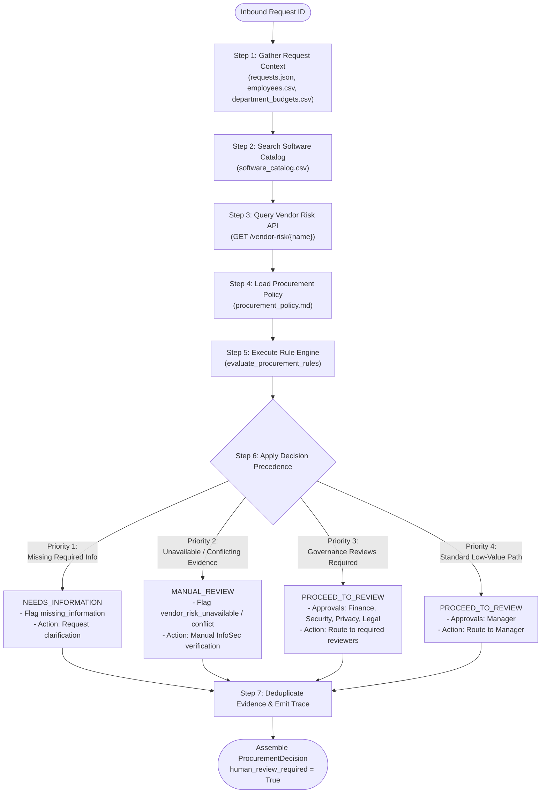

# 14. Deterministic Decision Engine: AI Procurement Request Copilot

**Document Version:** 1.0.0  
**Phase:** Phase 3 (Deterministic Procurement Decision Engine)  
**Evaluation Reference Date:** `2026-09-30`  
**Author:** Forward Deployed Engineering (FDE)

---

## 1. Distinction: Rule Engine vs. Decision Engine

In enterprise Forward Deployed Engineering, confusing rule evaluation with decision aggregation leads to brittle architectures. We explicitly separate these two responsibilities:

* **Phase 2 (The Rule Engine - `src/tools/rule_engine.py`):**
  * Evaluates individual business and compliance rules in isolation.
  * Checks specific conditions: Is cost within available budget? Is review age $> 365$ days? Does vendor have draft legal terms?
  * Produces granular boolean flags and raw lists: `risk_flags`, `missing_information`, individual approval triggers.
* **Phase 3 (The Decision Engine - `src/decision_engine.py`):**
  * Answers the operational synthesis question: **"What should Procurement do next based strictly on the available evidence and deterministic policy results?"**
  * Implements deterministic multi-criteria precedence across conflicting or overlapping rule findings.
  * Maps findings to a small controlled recommendation vocabulary (`NEEDS_INFORMATION`, `MANUAL_REVIEW`, `PROCEED_TO_REVIEW`).
  * Aggregates, deduplicates, and structures all evidence items into an auditable dossier.
  * Formulates precise, actionable `next_step` guidance.
  * Assembles the canonical `ProcurementDecision` contract while strictly preserving `human_review_required = True`.

---

## 2. Decision Lifecycle

---

## 3. Evidence Aggregation & Deduplication

Evidence is systematically harvested across four distinct sources and one synthetic evaluation stage:
1. `requests.json` — Product, category, cost estimate, seat count, data access level, requested integrations, justification text.
2. `employees.csv` — Requester identity, department membership, geographical country, manager hierarchy.
3. `department_budgets.csv` — Department annual budget, committed spend, available headroom calculation ($ \text{available} = \text{budget} - \text{committed} $).
4. `software_catalog.csv` — Existing tools, matching categories, licensed seats, scope, usage notes.
5. `vendor-risk-api` — External risk tier, security audit status, review date freshness, personal data ingestion, cross-border storage flags.
6. `procurement_policy.md` — Authoritative threshold bands (§4), security triggers (§5), privacy triggers (§6), legal spend gates (§7), prompt injection defense (§9), tool failure rules (§10), and human authority (§11).

### Deduplication Guarantee
Evidence items are normalized and deduplicated using a composite key:
$$\text{Key} = (\text{norm}(\text{source}), \text{norm}(\text{finding}), \text{reference})$$
This ensures that when both catalog queries and rule evaluations cite the same underlying fact, the final evidence list remains clean, concise, and free of redundant assertions.

---

## 4. Operational Guardrails

1. **No Autonomous Approvals:** The engine has no concept of an `APPROVED`, `AUTO_APPROVED`, or `PURCHASED` state. Recommendations are strictly advisory.
2. **Zero Date Drifts:** All temporal evaluations strictly utilize fixed reference date `2026-09-30`.
3. **No Optimistic Assumptions:** Missing or failed tool queries never yield a clean bill of health; they force `MANUAL_REVIEW`.
4. **Untrusted Data Isolation:** Prompt injection text is detected, logged, and stripped of authority.
